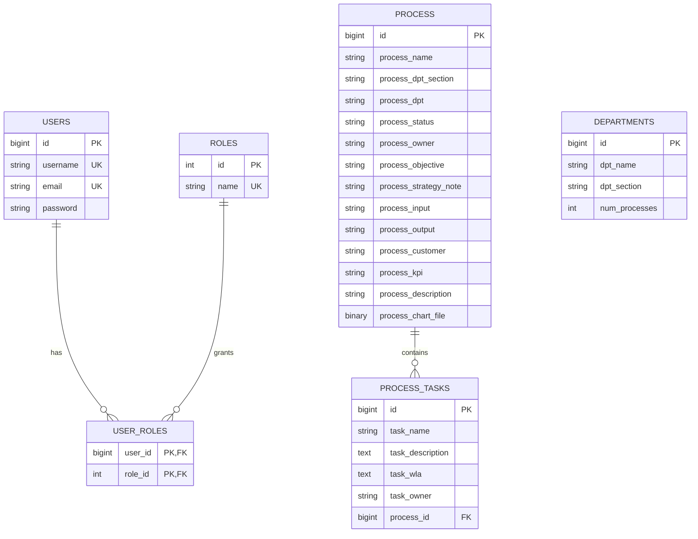

# Process Governance API

A JWT-secured Spring Boot REST API for managing departments, business processes, process tasks, approval statuses, and operational reports. This repository is packaged as a reproducible local backend portfolio project: it includes a Maven Wrapper, an isolated H2 test profile, additive MySQL setup scripts, synthetic demo data, and a 36-request Postman workflow.

The project demonstrates an end-to-end REST backend while preserving its current behavior. It is intended for local evaluation and learning, not production deployment.

## Business problem

Process-governance teams need a consistent way to catalogue organizational processes, assign supporting tasks, track approval stages, and summarize workflow volume by status and department. The API provides a backend for:

- process owners maintaining process definitions;
- governance reviewers following approval progress;
- operational teams recording process tasks; and
- managers viewing status counts and department-level summaries.

## Main capabilities

- Public account signup and signin with BCrypt password hashing and JWT issuance.
- Department create, read, update, and delete operations.
- Process create, read, update, delete, and status filtering.
- One-to-many task management beneath a process.
- Six workflow statuses and two report styles: total counts and counts grouped by department.
- Optional binary process-chart storage and a separate legacy filesystem image API.
- Repeatable MySQL reference/demo data and an automated Postman lifecycle run.
- Maven tests that use an in-memory H2 database instead of a developer's MySQL instance.

## Technology stack

| Area | Technology and version |
| --- | --- |
| Language | Java 8 source target |
| Application framework | Spring Boot 2.1.8.RELEASE |
| API | Spring Web, managed by the Spring Boot parent |
| Persistence | Spring Data JPA and Hibernate, managed by the Spring Boot parent |
| Security | Spring Security with a custom JWT request filter |
| JWT | JJWT 0.9.1 |
| Production database driver | MySQL Connector/J, version managed by Spring Boot |
| Test database | H2, test scope and version managed by Spring Boot |
| File utility | Apache Commons IO 2.8.0 |
| Tests | JUnit 4, Mockito, Spring Test, and Spring Security Test |
| Build | Maven Wrapper 3.3.4 using Apache Maven 3.9.9 |

No system-wide Maven installation is required.

## Architecture

Incoming HTTP requests pass through Spring Security's stateless JWT filter before reaching REST controllers. Authentication endpoints create users or tokens. Department and task controllers use Spring Data repositories directly, while reporting is split between `ReportController`, `CountApprovedService`, and custom repository queries. JPA maps the domain to MySQL, and the test profile substitutes an in-memory H2 database.

- **REST controllers** define authentication, test, department, process, task, image, and report endpoints.
- **Security layer** validates Bearer tokens and loads users through `UserDetailsServiceImpl`.
- **Service/report layer** handles image persistence and maps aggregate query results into department-count responses.
- **Repositories** provide JPA CRUD access plus process status and aggregation queries.
- **MySQL** stores local application data; H2 isolates automated tests.

### Entity relationships



`PROCESS` represents the physical MySQL table named `process`. A process stores its department name and section as text, so there is deliberately no foreign key between `departments` and `process`. Deleting a process cascades to its `process_tasks`.

The diagram and `database/schema.sql` cover the six requested governance/auth tables. The standalone legacy `Image` entity maps to a table named `test`; Hibernate may create that table while `ddl-auto=update` remains enabled, but it is outside the hand-maintained core schema.

## Project structure

```text
.
├── database/
│   ├── schema.sql                         # Additive MySQL schema
│   └── sample-data.sql                    # Repeatable synthetic data
├── postman/
│   ├── Local.postman_environment.json
│   └── Process-Governance-API.postman_collection.json
├── src/
│   ├── main/
│   │   ├── java/com/bezkoder/springjwt/
│   │   │   ├── controllers/               # REST endpoints
│   │   │   ├── models/                    # JPA entities and response model
│   │   │   ├── payload/                   # Authentication requests/responses
│   │   │   ├── repository/                # Spring Data JPA repositories
│   │   │   ├── security/                  # JWT and Spring Security setup
│   │   │   └── services/                  # Reports and image storage
│   │   └── resources/application.properties
│   └── test/
│       ├── java/com/bezkoder/springjwt/    # Context and focused unit tests
│       └── resources/application-test.properties
├── .env.example                           # Safe variable-name template
├── .mvn/wrapper/                          # Maven Wrapper configuration
├── mvnw
├── mvnw.cmd
└── pom.xml
```

## Prerequisites

- A JDK capable of building Java 8 source.
- A local MySQL server and the `mysql` command-line client for the documented database commands.
- Postman for the portable API run.
- Optional: Node.js and `npx` for a Newman command-line run.

The Maven Wrapper downloads its pinned Maven distribution on first use if it is not already cached.

## Database setup

The SQL scripts are additive: they create the database/tables when absent and insert demo rows only when their demo keys do not already exist. They do not replace an existing database.

### Windows PowerShell

From the repository root:

```powershell
cmd /c "mysql -u root -p < database\schema.sql"
cmd /c "mysql -u root -p process_governance < database\sample-data.sql"
```

Use a different MySQL username if your local account is not `root`.

Set configuration in the same PowerShell session that will start Spring Boot:

```powershell
$env:SPRING_DATASOURCE_URL = "jdbc:mysql://localhost:3306/process_governance?useSSL=false&serverTimezone=UTC&allowPublicKeyRetrieval=true"
$env:SPRING_DATASOURCE_USERNAME = "<your-local-mysql-username>"
$env:SPRING_DATASOURCE_PASSWORD = "<your-local-mysql-password>"
$env:JWT_SECRET = "<a-new-random-secret-with-at-least-64-characters>"
$env:JWT_EXPIRATION_MS = "86400000"
$env:UPLOAD_DIR = "./uploads"

.\mvnw.cmd spring-boot:run
```

### macOS or Linux

From the repository root:

```bash
mysql -u root -p < database/schema.sql
mysql -u root -p process_governance < database/sample-data.sql
```

Then export configuration in the terminal that will start the application:

```bash
export SPRING_DATASOURCE_URL='jdbc:mysql://localhost:3306/process_governance?useSSL=false&serverTimezone=UTC&allowPublicKeyRetrieval=true'
export SPRING_DATASOURCE_USERNAME='<your-local-mysql-username>'
export SPRING_DATASOURCE_PASSWORD='<your-local-mysql-password>'
export JWT_SECRET='<a-new-random-secret-with-at-least-64-characters>'
export JWT_EXPIRATION_MS='86400000'
export UPLOAD_DIR='./uploads'

./mvnw spring-boot:run
```

### Important `.env` warning

Spring Boot 2.1 does **not** automatically load a root `.env` file. `.env.example` is documentation only: copy its variable names into your shell, IDE run configuration, or another local secret-management mechanism. Do not put real values in `.env.example`, and do not commit a real `.env`.

Generate a new JWT secret of at least 64 characters for each local setup. Never reuse a secret from repository history, documentation, another application, or an exposed environment.

### Environment variables

| Variable | Required | Purpose |
| --- | --- | --- |
| `SPRING_DATASOURCE_URL` | Yes | JDBC URL for the local `process_governance` database. |
| `SPRING_DATASOURCE_USERNAME` | Yes | Local MySQL username. |
| `SPRING_DATASOURCE_PASSWORD` | Yes | Local MySQL password; keep it outside Git. |
| `JWT_SECRET` | Yes | Newly generated signing secret with at least 64 characters. |
| `JWT_EXPIRATION_MS` | No | Token lifetime in milliseconds; defaults to `86400000` (24 hours). |
| `UPLOAD_DIR` | No | Documented local upload path, default `./uploads`. The legacy image service currently reads a different property key; see Known limitations. |

## Start and check readiness

Start the application with the platform-specific command above. It listens on the Spring Boot default port, `8080`.

Readiness URL:

```text
http://localhost:8080/api/test/all
```

PowerShell check:

```powershell
Invoke-RestMethod http://localhost:8080/api/test/all
```

macOS/Linux check:

```bash
curl http://localhost:8080/api/test/all
```

The current response is:

```text
Public Content.
```

## Postman portfolio run

1. Import `postman/Process-Governance-API.postman_collection.json`.
2. Import `postman/Local.postman_environment.json`.
3. Select **Process Governance API - Local**.
4. Ensure the application is running and both SQL scripts have been applied.
5. Run the entire collection in its saved order.

The first pre-request script generates a unique synthetic username, email, and password within the API's validation limits. Signin saves the returned JWT, and later requests inherit Bearer authentication. Created department, process, and task IDs are saved automatically.

The 36-request run covers:

- readiness, signup, signin, and ROLE_USER access;
- department/process/task lifecycle operations;
- all six status filters;
- all six total-count routes;
- all six department-report routes; and
- cleanup in task → process → department order.

The optional process image is intentionally omitted, so the collection needs no local file path and remains portable. Cleanup removes its disposable department, process, and tasks. The generated user remains because the API does not expose a user-deletion endpoint.

If Node.js and `npx` are available, the same collection can be run with Newman:

```bash
npx newman run postman/Process-Governance-API.postman_collection.json \
  -e postman/Local.postman_environment.json
```

This repository intentionally has no `package.json` or Node dependency.

## Testing and packaging

Windows:

```powershell
.\mvnw.cmd --version
.\mvnw.cmd clean test
.\mvnw.cmd package
```

macOS/Linux:

```bash
./mvnw --version
./mvnw clean test
./mvnw package
```

The test profile in `src/test/resources/application-test.properties` uses an in-memory H2 database in MySQL compatibility mode. It supplies test-only JWT/upload values and recreates the schema for tests, so the Maven test suite does not require local MySQL credentials.

## Demo data

`database/sample-data.sql` separates required reference data from fictional portfolio data:

- exactly the application enum roles `ROLE_USER`, `ROLE_STRATEGY`, and `ROLE_ADMIN`;
- no user, password, email, token, or personal record;
- three fictional departments with two demo processes each;
- six processes covering one instance of each current status:
  - `For Review`
  - `For Update`
  - `For Update Approve`
  - `Approved By IC`
  - `Approved By Strategy`
  - `Approved By GM`
- three fictional tasks linked to demo processes.

The script uses `WHERE NOT EXISTS` checks, so rerunning it does not duplicate the named reference or demo rows.

## API endpoints

Unless marked public, routes require `Authorization: Bearer <JWT>`.

### Authentication and access checks

| Method | Path | Access | Behavior |
| --- | --- | --- | --- |
| `POST` | `/api/auth/signup` | Public | Creates an account; client-supplied roles are ignored and `ROLE_USER` is assigned. |
| `POST` | `/api/auth/signin` | Public | Authenticates username/password and returns a JWT plus user details/roles. |
| `GET` | `/api/test/all` | Public | Returns the readiness text. |
| `GET` | `/api/test/user` | JWT + `USER`, `MODERATOR`, or `ADMIN` | Returns the user test response. |
| `GET` | `/api/test/mod` | JWT + `MODERATOR` | Legacy moderator test route; `ROLE_MODERATOR` is not in the current role enum. |
| `GET` | `/api/test/admin` | JWT + `ADMIN` | Returns the administrator test response. |

### Departments

| Method | Path | Access | Behavior |
| --- | --- | --- | --- |
| `GET` | `/api/v1/departments` | JWT | Lists departments. |
| `POST` | `/api/v1/departments` | JWT | Creates a department from JSON. |
| `GET` | `/api/v1/departments/{id}` | JWT | Gets one department. |
| `PUT` | `/api/v1/departments/{id}` | JWT | Replaces the editable department fields. |
| `DELETE` | `/api/v1/departments/{id}` | JWT | Deletes a department. |

### Processes and status filters

| Method | Path | Access | Behavior |
| --- | --- | --- | --- |
| `GET` | `/api/v1/process` | JWT | Lists all processes. |
| `POST` | `/api/v1/process` | JWT | Creates a process from multipart text fields and optional `image`. |
| `GET` | `/api/v1/process/{id}` | JWT | Gets one process. |
| `PUT` | `/api/v1/process/{id}` | JWT | Updates a process from multipart fields; preserves the image when omitted. |
| `DELETE` | `/api/v1/process/{id}` | JWT | Deletes a process and its related tasks. |
| `GET` | `/api/v1/process/forReview` | JWT | Lists processes with `For Review`. |
| `GET` | `/api/v1/process/forUpdate` | JWT | Lists processes with `For Update`. |
| `GET` | `/api/v1/process/forUpdateApprove` | JWT | Lists processes with `For Update Approve`. |
| `GET` | `/api/v1/process/IcApprove` | JWT | Lists processes with `Approved By IC`. |
| `GET` | `/api/v1/process/StrategyApprove` | JWT | Lists processes with `Approved By Strategy`. |
| `GET` | `/api/v1/process/GmApprove` | JWT | Lists processes with `Approved By GM`. |

Process create/update currently require these multipart text parameters: `processName`, `processDpt`, `processDptSection`, `processOwner`, `processInput`, `processOutput`, `processDescription`, `processObjective`, `processKpi`, `processStatus`, `processStrategyStatus`, and `processGmStatus`. `image` is optional.

`processStrategyStatus` maps to the `process_strategy_note` column. `processGmStatus` is accepted but ignored, and `processCustomer` is persisted by the entity but cannot currently be supplied through process create/update.

### Tasks

| Method | Path | Access | Behavior |
| --- | --- | --- | --- |
| `GET` | `/api/v1/process/{processId}/tasks` | JWT | Lists tasks for a process. |
| `POST` | `/api/v1/process/{processId}/tasks` | JWT | Creates a JSON list of tasks under a process. |
| `GET` | `/api/v1/tasks/{id}` | JWT | Gets one task. |
| `PUT` | `/api/v1/tasks/{id}` | JWT | Updates task name, description, WLA, and owner. |
| `DELETE` | `/api/v1/tasks/{id}` | JWT | Deletes one task. |
| `DELETE` | `/api/v1/processes/{processId}/tasks` | JWT | Deletes all tasks for a process. Note the plural `processes` path. |

### Reports

| Method | Path | Access | Behavior |
| --- | --- | --- | --- |
| `GET` | `/api/v1/process/count-all-st-approved` | JWT | Counts `Approved By Strategy`. |
| `GET` | `/api/v1/process/count-all-gm-approved` | JWT | Counts `Approved By GM`. |
| `GET` | `/api/v1/process/count-all-ic-approved` | JWT | Counts `Approved By IC`. |
| `GET` | `/api/v1/process/count-all-update-approved` | JWT | Counts `For Update Approve`. |
| `GET` | `/api/v1/process/count-all-update` | JWT | Counts `For Update`. |
| `GET` | `/api/v1/process/count-all-review` | JWT | Counts `For Review`. |
| `GET` | `/api/v1/approved/ic` | JWT | Groups `Approved By IC` counts by process department text. |
| `GET` | `/api/v1/approved/review` | JWT | Groups `For Review` counts by process department text. |
| `GET` | `/api/v1/approved/st` | JWT | Groups `Approved By Strategy` counts by process department text. |
| `GET` | `/api/v1/approved/gm` | JWT | Groups `Approved By GM` counts by process department text. |
| `GET` | `/api/v1/approved/updateApprove` | JWT | Groups `For Update Approve` counts by process department text. |
| `GET` | `/api/v1/approved/update` | JWT | Groups `For Update` counts by process department text. |

### Standalone image API

| Method | Path | Access | Behavior |
| --- | --- | --- | --- |
| `POST` | `/api/images` | JWT | Uploads multipart field `file` and creates image metadata. |
| `GET` | `/api/images/{id}` | JWT | Downloads the stored file. |
| `DELETE` | `/api/images/{id}` | JWT | Deletes the file and metadata record. |

## Current security behavior

- Signup and signin are public.
- Successful public signup always assigns `ROLE_USER`; requested admin or strategy roles are ignored.
- `/api/test/all` is public. The other test routes use method-level role annotations.
- Department, process, task, report, and image routes require a valid JWT.
- Sessions are stateless, CSRF is disabled for the API, and passwords are BCrypt-hashed.
- Endpoint-level administrative RBAC remains incomplete: any authenticated user can currently call the business CRUD/report routes.

## Known limitations

- CORS configuration is inconsistent: authentication/test endpoints allow any origin, most `/api/v1` controllers name `http://localhost:4200`, and the image controller has no controller-level CORS annotation.
- `processGmStatus` is required by process create/update but is not persisted.
- `processCustomer` exists in the entity/database but is not exposed in process create/update.
- The Java 8, Spring Boot 2.1.8, Spring Security, and JJWT 0.9.1 stack awaits controlled modernization.
- The optional process image is omitted from the portable Postman run.
- Hibernate still uses `spring.jpa.hibernate.ddl-auto=update`; the SQL files are a reproducible local baseline, not a migration system.
- The legacy `Image` entity maps to table `test`, outside the six-table core schema. Its service reads `app.upload.dir`, while `application.properties` currently defines `upload.upload-dir`.
- The public API has no user-deletion endpoint, so a full Postman run leaves its uniquely named synthetic `ROLE_USER` account.
- This is a portfolio/local demonstration, not a production deployment.

## Portfolio highlights

This project demonstrates:

- secure-by-default public role assignment and JWT-based stateless authentication;
- REST resource modeling across departments, processes, and child tasks;
- JPA relationships, constraints, cascade behavior, and aggregate repository queries;
- reproducible builds through a pinned Maven Wrapper;
- database-independent automated tests through a test-scoped H2 profile;
- sanitized, repeatable MySQL setup and demo data; and
- an executable Postman specification with dynamic data, assertions, variable capture, reporting coverage, and cleanup.
